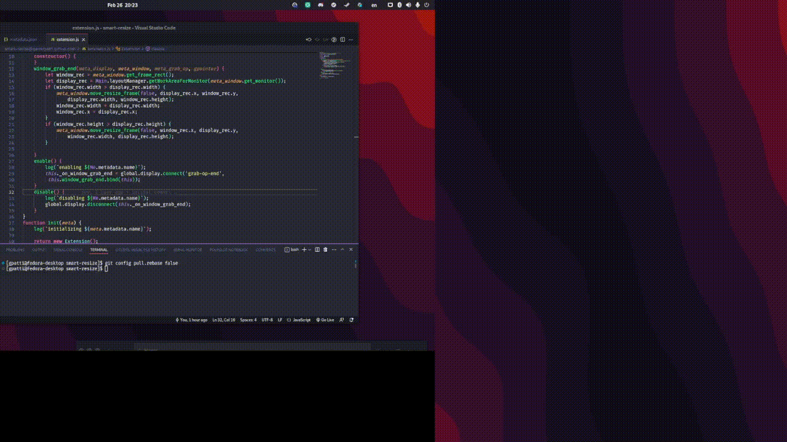
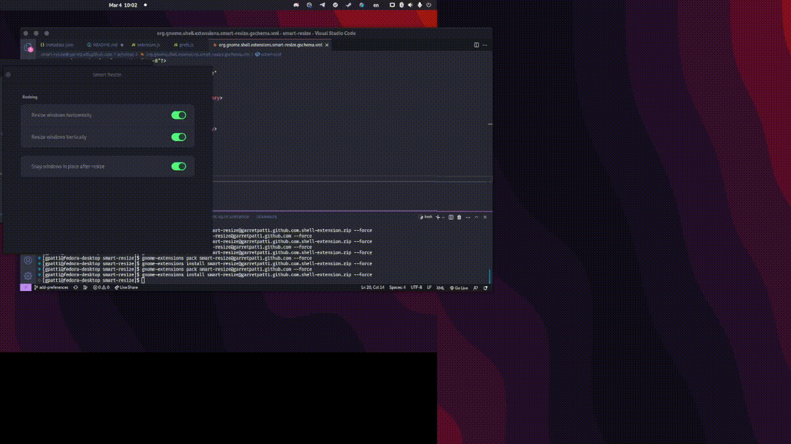

# Smart Resize GNOME extension
A gnome shell extension for automatically resizing a window that is too large 
for the current screen. Great for when you have a vertical or lower resolution 
monitor and don't want to resize windows to fit everytime you move something to
it. Simply drag a window onto the screen you want it on and if it is too large
it will resize to fit the width/height of the window. 

## New in Version 2
Now has a preferences screen that lets you decide which dimensions will be 
resized and whether the window "snaps" into place when resized.

